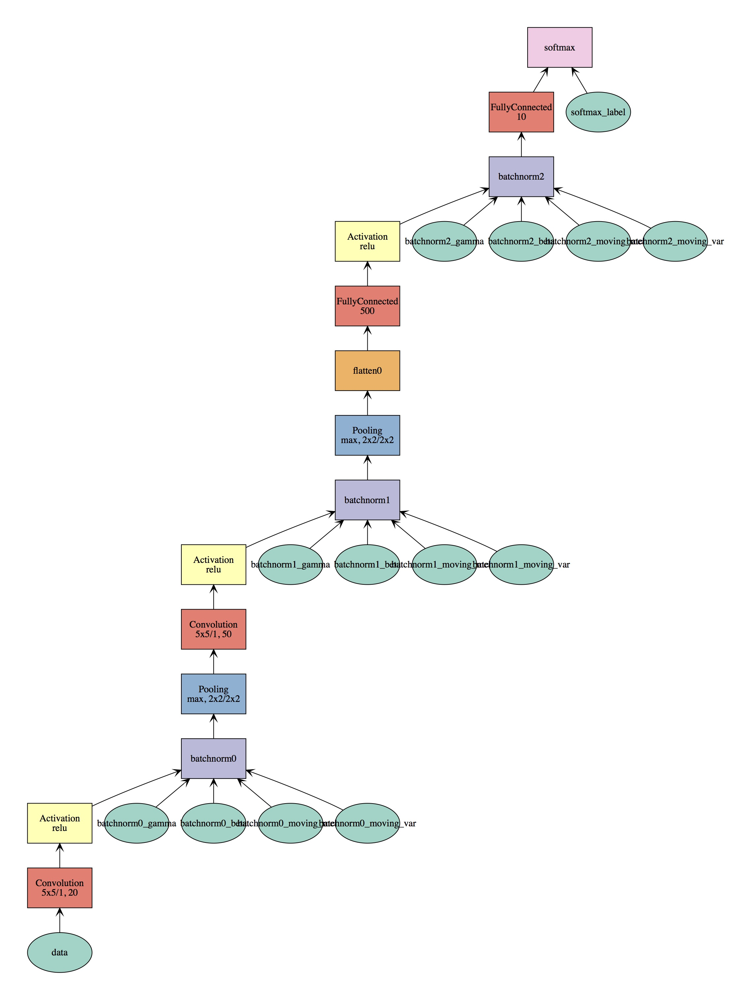

## Run Network
```
virtualenv env
source env/bin/activate
pip install -r requirements.txt
python train_mlp.py
```

## Network Performance Comparison
| Comparison        | MLP      | CNN      |
| ----------------- | -------- | -------- |
| Acc(5 epoch)      | 0.975100 | 0.986300 |
| CPU Epoch time(s) | 1.246    | 36.808   |

## CNN architecture

